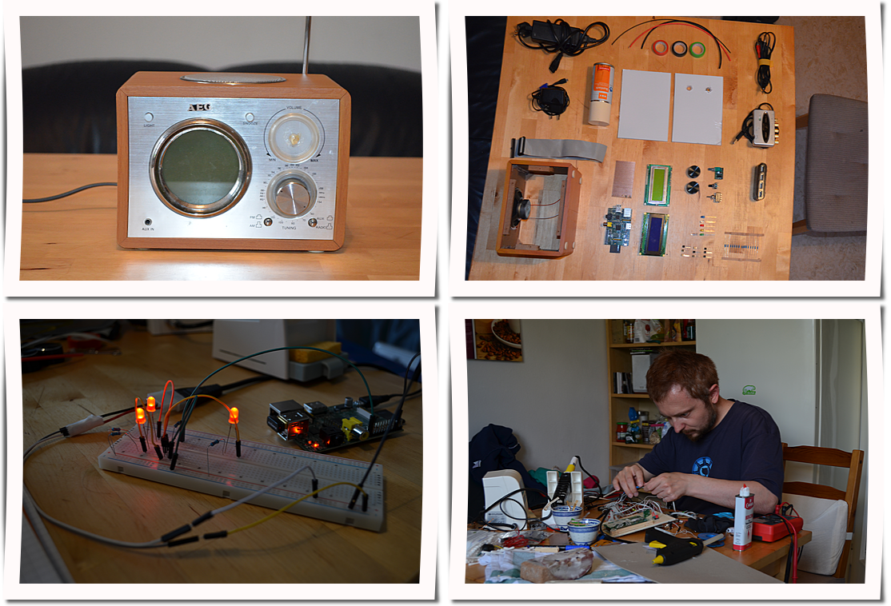
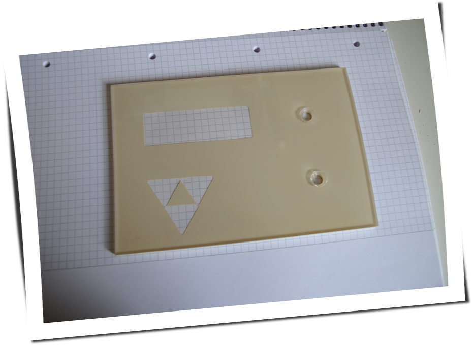
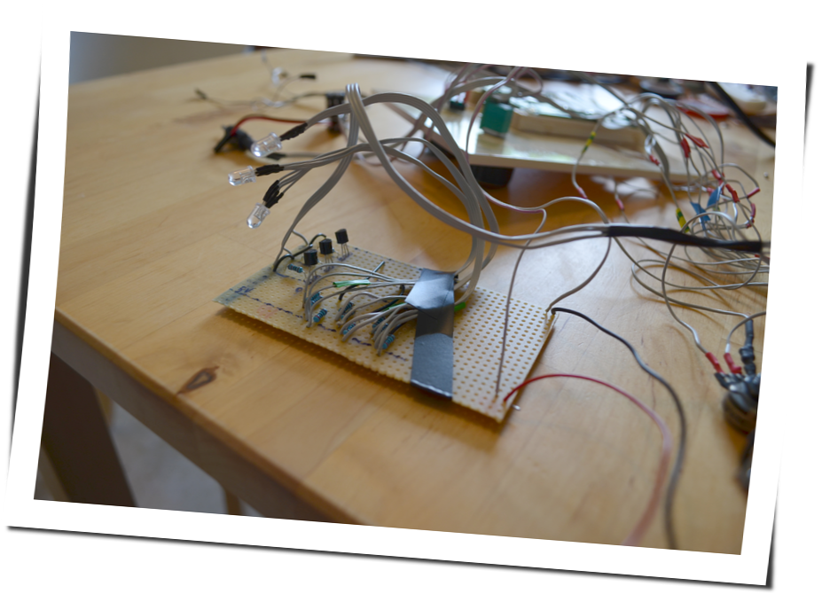
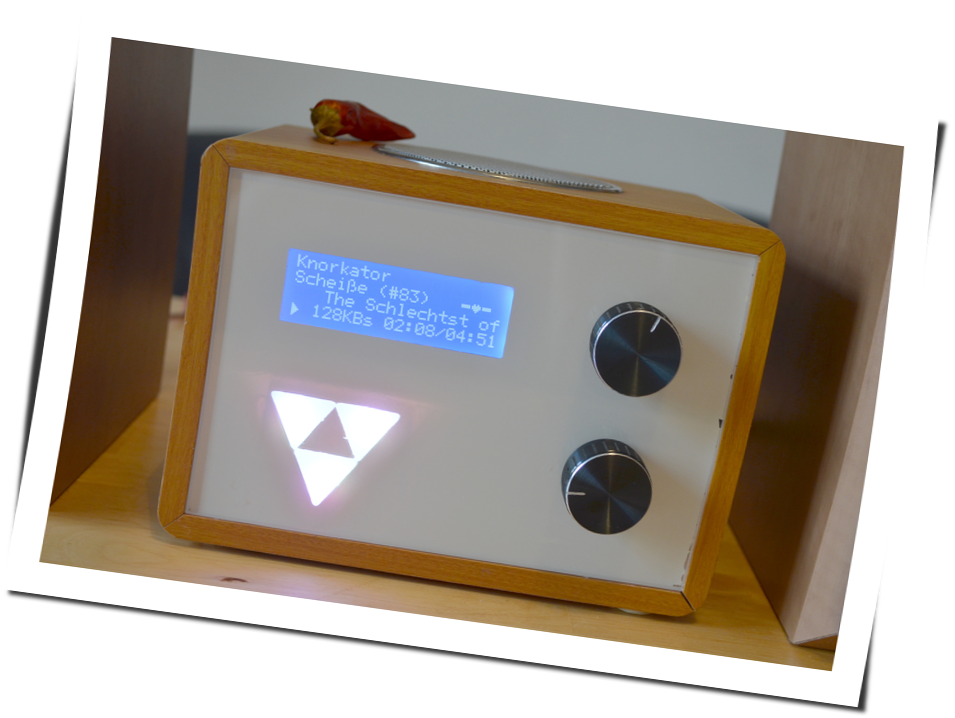
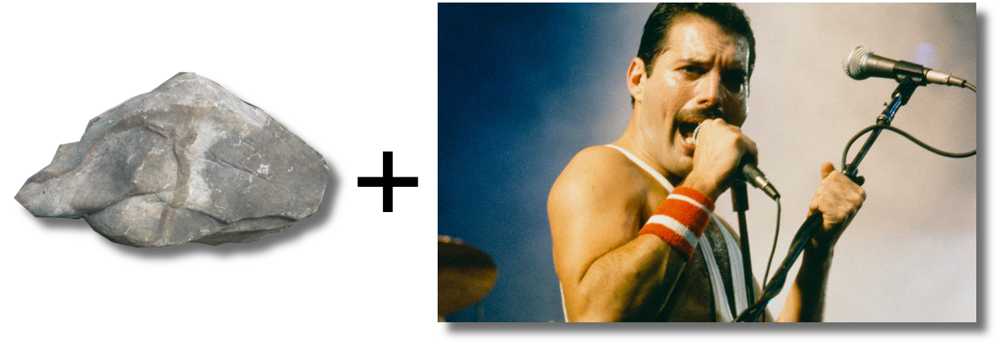
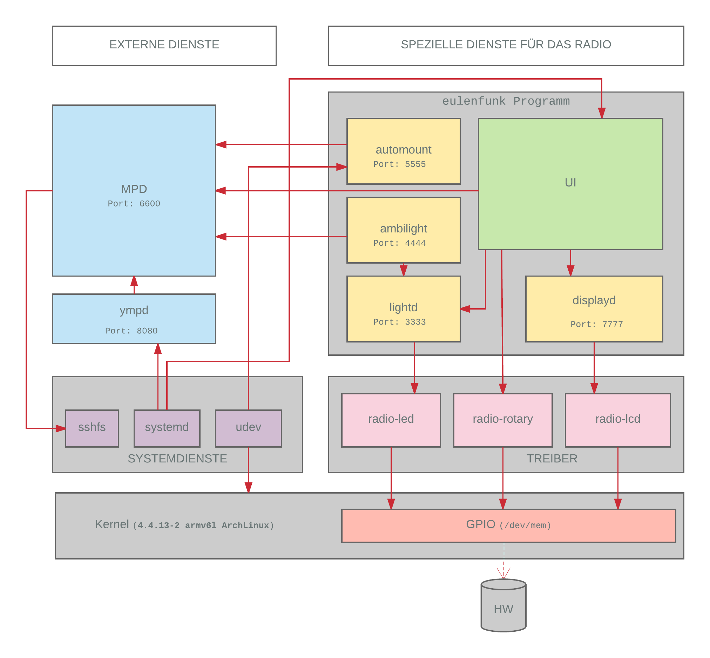
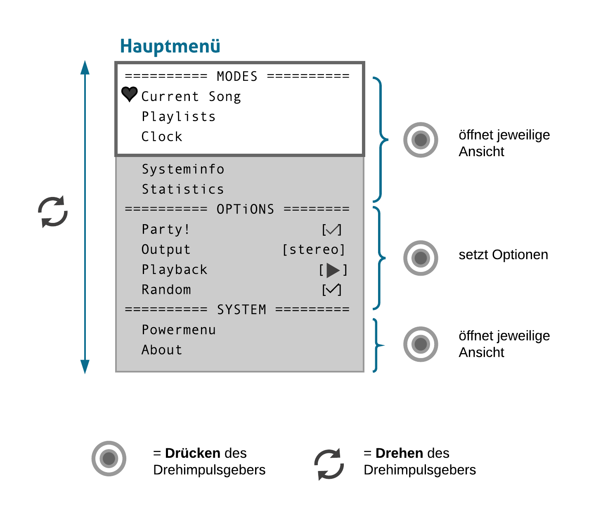

:title: Eulenfunk
:author: Susanne Kiessling, Christopher Pahl, Christoph Piechula
:description: The Hovercraft! tutorial.
:keywords: presentation, backend, impress.js, hovercraft, go-lang
:css: presentation.css

----

.. utility roles

.. role:: underline
    :class: underline

.. role:: blocky
   :class: blocky

:id: first 

Projekt: **Eulenfunk**

.. image:: ../paper/images/title.png
   :width: 60%
   :align: center

----

:blocky:`Diese Praesentation...`

**gibt eine Übersicht über:**

- Unsere Wohngemeinschaft in Augsburg.
- Unser Open-Source-Project namens Eulenfunk.
- Den Weg vom Schrott zum Radio.
- Überblick über Vorbereitungen, Entwicklung und Testphase
- Probleme während der Umsetzung.

**...und soll Lust auf mehr machen!**

----

.. note::

    * Leben in einer WG zusammen
    * Alte Musikanlage erklaeren
    * Herausforderung für nicht-technischen Informatiker
    * Anforderungen: Nutzung vorhandener Hardware
    * Preis/Leistung
    * Moodbar (faszniniert von LEDs)
    * Erweiterbar

:blocky:`Dieses Eulenfunk...`

**...ist entstanden weil:**

- Aktuelle Musik-Situation... war kompliziert.
- Wir etwas für den täglichen Gebrauch bauen wollten.
- Alte Hardware vorhanden war.

**...ist anders weil:**

- Es kein Nachbau ist.
- Eigene Anforderungen umgesetzt wurden.
- Diamanten nur unter Druck entstehen.

-----

:blocky:`Bilder sagen manchmal mehr als...`

-----

.. note:: 

    * Geschichte vom alten Radio (es war einmal)

:blocky:`Altes Analogradio:`

.. image:: images/impressions/Altes_AEG_MR_4104_pol.png
   :width: 100%

-----

.. note:: 

    * Komponenten kurz ansprechen
    * Preis/Leistungsverhaeltnis

:blocky:`Some assembly required:`

.. image:: images/impressions/componentes1_pol.png
   :width: 120%

-----

.. note:: 

    * LCD Spannung und Anschluesse
    * Arduino Breadboard/Baukasten
    * Langsames Herantasten an Hardware

:blocky:`Testaufbau der Basiskomponenten`

.. image:: images/impressions/LCD_Testaufbau_pol.png
   :width: 110%

-----

.. note::

    * Testaufbau Transistorschaltung.
    * Externes 5V Netzteil
    * PNP/NPN Problem

:blocky:`Testaufbau zur Ansteuerung der LEDs`

.. image:: images/impressions/Transistorschaltung_Testaufbau_pol.png
   :width: 100%

-----

.. note::

    * Von ira-kunststoffe und lackieren erzaehlen
    * Stundelange Diskussion welches Logo
    * Eigentlich ein Triforce...
    * ...aber jetzt ist es Neon Demon.

:blocky:`Lackierung`

-----

.. note::

    * Drehimpulsgeber
    * Befestigung von Holzstuecken von Hand mit Messer zugeschnitten
    * Viel Heiskleber
    * Audioverstaerker
    * Chirugische Praezision
    * Triforce-Dimming Blende mit kuechenmesser zugeschnitten

:blocky:`Vorderseite von hinten`

.. image:: images/impressions/Front_mit_LCD_und_Switches_pol.png
   :width: 100%

-----

:blocky:`Chirugische Praezision...`

-----

.. note::

    * Eine Woche kuechenchaos...
    * Viel loetarbeiten und trial & error
    * Parallel beginn der Softwareentwicklung

:blocky:`Informatiker bei der Arbeit...`

.. image:: images/impressions/Hardware-Engineering_pol.png
   :width: 100%

-----

:blocky:`Finaler Prototyp`

.. note::

    * Hoffentlich koennt ihr das lied nicht erkennen :)

-----

:blocky:`Die Hardware`

.. image:: ../paper/images/uebersicht.png
   :width: 90%
   :align: right

-----

:blocky:`Moodbar`

.. note:: 

    * Bilderraetsel

.. image:: images/we-will-rock-you.png
   :width: 110%
   :align: left 

|
|
|

-----

:blocky:`Die Software`

.. note::

    * Hat dann doch mehr als 2 Wochen gedauert 
    * Sehr modular

-----

.. note::

    * Europaeische Variante des LCD.
    * Keine Encoding Tabelle gefunden, daher Abbildung
    * in muehevoller Handarbeit erstellt

:blocky:`Enkodierung`

.. image:: ../paper/images/encoding.png
   :width: 100%
   :align: right

-----

:blocky:`Bedienung`

.. note:: 

    1. Playlisten von USB--Sticks

-----

:blocky:`Demonstration`

.. image:: images/effekt.png
   :width: 100%
   :align: center

-----

:blocky:`Probleme...`

.. note:: 

    - Probleme mit Netzteilen erlaeutern
    - Backfeed problem erklaeren
    - schwache hardware fuer visuelle Effekte
    - Go war gut, trotz fehlender Libraries.

- Nur wenige Hardware Pins mit PWMs.
- Strom/Spannungsversorgungsprobleme.
- Prinzipiell schwache Hardware.

:blocky:`...und was gut ging:`

- Go ist nett.
- Kein Hausbrand ausgelöst.
- Bedienungskonzept passt.

|

-----

:blocky:`Schuhu (Ende)`

**Prototyp ist noch verbesserungswürdig:**

- Netzteil/USB-Hub.
- Entstörung div. Komponenten.
- Komponenten »besser« im Gehäuse unterbringen.
- Design verschönern? Logo? 
- Softwareoptimierungen.
- Alpine Linux?

**Wir haben:**

- Spaß gehabt.
- Alte Hardware nutzbar gemacht.
- Viel gelernt (Pi-Probleme, Hardware...).
- Ein neues Küchenradio.

.. note::

    none

-------

:id: fin

.. note::

    BOOK!

    If you really want to dive in Go, I can recommend those:

:blocky:`Lust bekommen...`

**Dokumentation & Quellen:**

    https://github.com/studentkittens/eulenfunk

|
|

**(Noch Fragen?)**
