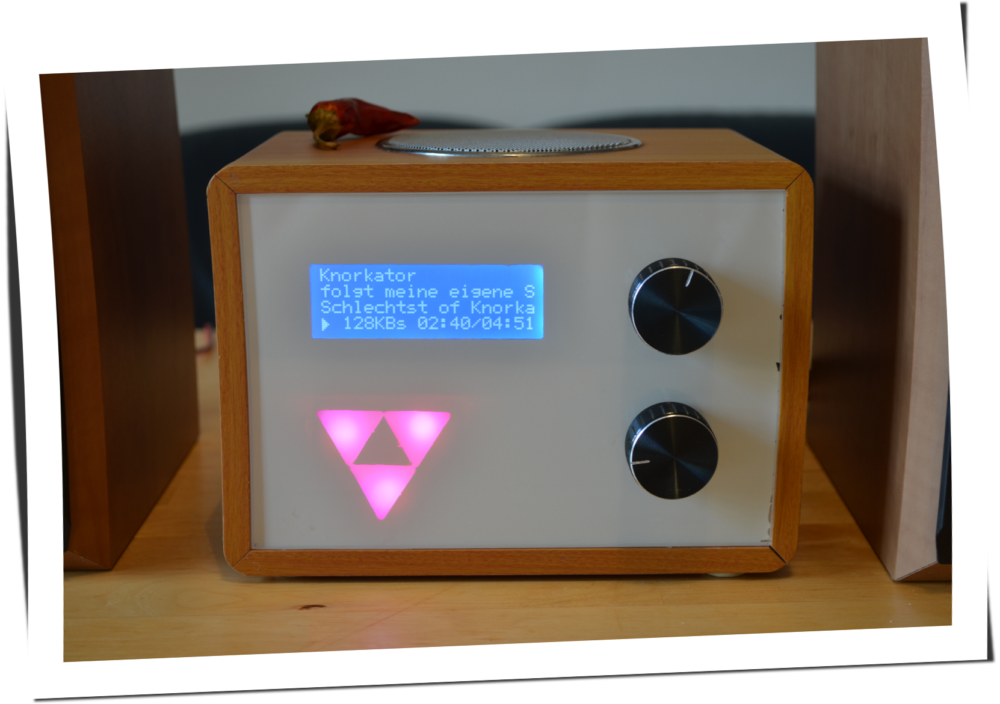

:title: Eulenfunk
:author: Susanne Kiessling, Christopher Pahl, Christoph Piechula
:description: The Hovercraft! tutorial.
:keywords: presentation, backend, impress.js, hovercraft, go-lang
:css: presentation.css

----

.. utility roles

.. role:: underline
    :class: underline

.. role:: blocky
   :class: blocky

:id: first 

Projekt: Eulenfunk

----

:blocky:`Die Praesentation...`

**gibt eine Übersicht über:**

- Weiß nich?
- Eine Wohngemeinschaft in Augsburg.
- Den Weg vom Schrott zum Radio.
- Neues Open-Source-Project.

**gibt keine Details zu:**

- Hardwareansteuerung.
- Softwareimplementierung.

- Internetradio für die Küche.
- Auf Basis ,,alter'' Bauteile.

----

:blocky:`Dieses Eulenfunk...`

**ist entstanden weil:**

- Wir mit einer Eule zusammenleben.
- Wir uns gerne in der Küche aufhalten.
- Aktuelle Musik-Situation... war kompliziert.
- Etwas ,,sinnvolles'' erstellt werden sollte.
- Technische Informatiker Magie sein kann.
- Wir Spaß haben wollten mit LEDs!

**ist anders weil:**

- Es kein Nachbau ist.
- Eigene Anforderungen umgesetzt wurden.

.. note::

    None

-----

:blocky:`Hardwarekomponenten`

* Blockschaubild

-----

:blocky:`Softwarekomponenten`

* Blockschaubild

-----

:blocky:`Impressions #1`

* Bilder Hardware

-----

:blocky:`Impressions #2`

* Bilder Testaufbau

-----

:blocky:`Impressions #3`

* Bilder Arbeit

-----

:blocky:`Impressions #4`

* Bilder Elche oder Meerschweinchen.

-----

:blocky:`Demonstration`

-----

:blocky:`Probleme`

- Wenige HW PWMs
- Strom/Spannungsversorgungsprobleme
- Prinzipiell schwache Hardware

-----

:blocky:`Schuhu (Ende)`

**Prototyp ist noch verbesserungswürdig:**

- Netzteil/USB-Hub.
- Entstörung div. Komponenten.
- Komponenten ,,besser'' im Gehäuse unterbringen.
- Design verschönern? Logo? 
- Softwareoptimierungen.
- Distribution?

**Wir haben:**

- Spaß gehabt.
- Alte Hardware nutzbar gemacht.
- Viel gelernt (Pi-Probleme, Hardware...).
- Ein neues Küchenradio.

.. note::

    none

-------

:id: fin

.. note::

    BOOK!

    If you really want to dive in Go, I can recommend those:

:blocky:`Lust bekommen...`

**Dokumentation & Quellen:**

    https://github.com/studentkittens/eulenfunk

|
|

**(Noch Fragen?)**
